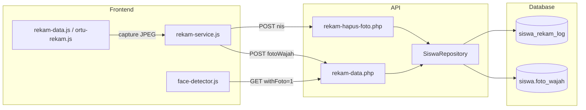

# Panduan Rekam Wajah — Penyimpanan ke Database

> **Penting — bukan foto profil:** **Rekam wajah** (`siswa_wajah.foto_wajah`, base64) dipakai untuk **absensi** dan verifikasi biometrik. **Foto profil** (`profil_siswa.photo_path`, WebP di storage) dipakai untuk **kartu pelajar** dan identitas visual. Daftar siswa membaca flag terindeks `siswa.has_foto_wajah`; blob hanya dimuat oleh endpoint foto.

> **Implementasi Laravel (repo ini)** — bagian di bawah yang merujuk `admin/api/rekam-data.php` adalah dokumentasi legacy dari proyek PHP asli. Di Laravel, gunakan endpoint dan UI berikut:

| Area | Laravel |
|------|---------|
| Admin — Data Siswa | Menu baris **Rekam wajah** atau halaman **Detail siswa** → modal `face-capture-modal` |
| Admin — simpan/hapus | `POST/DELETE admin/manajemen-siswa/data-siswa/{siswa}/rekam-wajah` (`DataSiswaController` + trait `HandlesFaceCapture`) |
| Admin — tampil foto | `GET admin/manajemen-siswa/data-siswa/{siswa}/foto-wajah` |
| Portal siswa | `portal/siswa/profil` — rekam wajah mandiri |
| JS | `public/js/face-capture.js` |
| Log | `siswa_rekam_log` via `HandlesFaceCapture::logFaceCapture()` |
| Toast sukses | `ActionMessage::withSubject('Foto wajah berhasil disimpan', ActionMessage::siswa($siswa))` |

---

Dokumen ini menjelaskan cara kerja fitur **rekam wajah** di sistem ini: foto diambil dari kamera browser, dikirim ke API PHP, lalu disimpan di tabel 1:1 `siswa_wajah`. Flag `siswa.has_foto_wajah` dan log `siswa_rekam_log` diperbarui dalam transaksi yang sama.

Dokumen ini bisa dipakai sebagai referensi saat membangun project serupa.

---

## Ringkasan alur (legacy PHP)

> Di Laravel, alur setara: kamera → base64 → `POST .../rekam-wajah` → `siswa_wajah.foto_wajah` + `siswa.has_foto_wajah` + `siswa_rekam_log`.

```
[Kamera browser]
      │
      ▼
[Canvas → JPEG base64 (data URL)]
      │
      ▼
POST /admin/api/rekam-data.php  { siswaId, fotoWajah }
      │
      ▼
[SiswaRepository::update] → UPDATE siswa SET foto_wajah = ...
      │
      ▼
INSERT siswa_rekam_log (riwayat)
      │
      ▼
[Modul Face Detector] GET ?withFoto=1 → bandingkan wajah live vs foto referensi
```

---

## Struktur database

Jalankan skema di `admin/database/schema.sql`. Bagian yang relevan untuk rekam wajah:

### Tabel `siswa`

| Kolom | Tipe | Keterangan |
|-------|------|------------|
| `id` | VARCHAR(64) | Primary key siswa |
| `nis` | VARCHAR(32) | Nomor induk (unik) |
| `nama` | VARCHAR(255) | Nama siswa |
| `aktif` | TINYINT(1) | `1` = ikut modul presensi |
| `rfid_uid` | VARCHAR(64) | UID kartu RFID (opsional) |
| **`foto_wajah`** | **LONGTEXT** | **Foto wajah dalam format base64 (biasanya `data:image/jpeg;base64,...`)** |
| `kode_suara` | VARCHAR(512) | Frasa pengenalan suara (opsional) |

### Tabel `siswa_rekam_log`

Riwayat setiap kali admin/ortu menyimpan data rekam:

| Kolom | Keterangan |
|-------|------------|
| `siswa_id` | ID siswa |
| `nis` | NIS siswa |
| `jenis` | `rfid` \| `foto` \| `suara` \| `lengkap` |
| `punya_foto` | `1` jika foto tersimpan |
| `created_at` | Waktu simpan |

### Contoh SQL

```sql
-- Cek siswa yang sudah punya foto
SELECT id, nis, nama,
       CASE WHEN foto_wajah IS NOT NULL AND CHAR_LENGTH(foto_wajah) > 30 THEN 1 ELSE 0 END AS punya_foto
FROM siswa
WHERE aktif = 1
ORDER BY nama;

-- Riwayat rekam foto terakhir
SELECT l.*, s.nama
FROM siswa_rekam_log l
JOIN siswa s ON s.id = l.siswa_id
WHERE l.punya_foto = 1
ORDER BY l.created_at DESC
LIMIT 20;
```

---

## Endpoint API

File utama: **`admin/api/rekam-data.php`** (sumber tunggal admin & portal ortu).

| Method | URL | Fungsi |
|--------|-----|--------|
| `GET` | `/admin/api/rekam-data.php` | Daftar ringkas semua siswa (tanpa base64 foto, hanya flag `hasFoto`) |
| `GET` | `/admin/api/rekam-data.php?id={id}` | Detail satu siswa **lengkap dengan** `fotoWajah` |
| `GET` | `/admin/api/rekam-data.php?withFoto=1` | Semua siswa aktif yang punya foto + base64 (untuk Face Detector) |
| `POST` | `/admin/api/rekam-data.php` | Simpan `rfidUid`, `fotoWajah`, dan/atau `kodeSuara` |
| `POST` | `/admin/api/rekam-hapus-foto.php` | Hapus foto wajah berdasarkan NIS |

Endpoint lama `rekam-simpan.php` masih ada, tetapi **disarankan memakai `rekam-data.php`** karena mendukung GET + POST dalam satu file.

### Format request simpan foto

```http
POST /admin/api/rekam-data.php
Content-Type: application/json

{
  "siswaId": "mm-220007",
  "fotoWajah": "data:image/jpeg;base64,/9j/4AAQSkZJRg..."
}
```

Field `siswaId` bisa berupa `id` internal atau `nis` (server akan mencari lewat `findByIdOrNis`).

### Format respons sukses

```json
{
  "ok": true,
  "data": {
    "id": "mm-220007",
    "nis": "220007",
    "nama": "Ahmad Fauzi",
    "fotoWajah": "data:image/jpeg;base64,...",
    "hasFoto": true,
    "rfidUid": "",
    "kodeSuara": ""
  }
}
```

### Contoh `curl`

```bash
# Daftar ringkas (tanpa foto)
curl -s "https://domain-anda.com/admin/api/rekam-data.php"

# Ambil foto satu siswa
curl -s "https://domain-anda.com/admin/api/rekam-data.php?id=220007"

# Simpan foto (ganti BASE64 dengan string data URL asli)
curl -s -X POST "https://domain-anda.com/admin/api/rekam-data.php" \
  -H "Content-Type: application/json" \
  -d '{"siswaId":"220007","fotoWajah":"data:image/jpeg;base64,..."}'

# Hapus foto
curl -s -X POST "https://domain-anda.com/admin/api/rekam-hapus-foto.php" \
  -H "Content-Type: application/json" \
  -d '{"nis":"220007"}'
```

---

## Contoh kode backend (PHP)

### Simpan foto ke tabel `siswa`

Cuplikan dari `admin/api/rekam-data.php`:

```php
<?php
// POST body: { "siswaId": "...", "fotoWajah": "data:image/jpeg;base64,..." }

$repo = new SiswaRepository();
$existing = $repo->findByIdOrNis($siswaId);
if (!$existing) {
    api_json(['ok' => false, 'error' => 'Siswa tidak ditemukan'], 404);
}

if (array_key_exists('fotoWajah', $body)) {
    $existing['fotoWajah'] = (string) $body['fotoWajah'];
}

$saved = $repo->update($siswaId, $repo->apiToDb($existing));

// Catat log
$hasFoto = !empty($saved['fotoWajah']) && strlen((string) $saved['fotoWajah']) > 30;
$pdo->prepare(
    'INSERT INTO siswa_rekam_log (siswa_id, nis, jenis, rfid_uid, punya_foto, kode_suara)
     VALUES (:siswa_id, :nis, :jenis, :rfid_uid, :punya_foto, :kode_suara)'
)->execute([
    ':siswa_id' => $siswaId,
    ':nis'       => $saved['nis'] ?? '',
    ':jenis'     => 'foto',
    ':rfid_uid'  => $saved['rfidUid'] ?? null,
    ':punya_foto'=> $hasFoto ? 1 : 0,
    ':kode_suara'=> $saved['kodeSuara'] ?? null,
]);

api_json(['ok' => true, 'data' => $saved]);
```

### Mapping API → kolom database

Dari `SiswaRepository::apiToDb()`:

```php
$db = [
    'id'         => $id,
    'nis'        => trim((string) ($api['nis'] ?? '')),
    'nama'       => trim((string) ($api['nama'] ?? '')),
    'foto_wajah' => $api['fotoWajah'] ?? $api['foto_wajah'] ?? null,
    'rfid_uid'   => (string) ($api['rfidUid'] ?? ''),
    'kode_suara' => (string) ($api['kodeSuara'] ?? ''),
    // ...
];
```

### Ambil daftar referensi wajah (untuk presensi)

```php
public function listWithFoto(): array
{
    $stmt = $this->pdo->query(
        'SELECT id, nis, nisn, nama, kelas_id, jenis_kelamin, aktif, foto_wajah
         FROM siswa
         WHERE foto_wajah IS NOT NULL
           AND CHAR_LENGTH(foto_wajah) > 30
           AND aktif = 1
         ORDER BY nama ASC, nis ASC'
    );
    // ... kembalikan sebagai array dengan key camelCase: fotoWajah
}
```

---

## Contoh kode frontend (JavaScript)

### 1. Layanan API — `PresensiRekamService`

File: `admin/js/rekam-service.js`

```javascript
// Simpan foto wajah
window.PresensiRekamService.save({
  siswaId: "mm-220007",
  fotoWajah: dataUrl, // dari canvas.toDataURL()
}).then(function (saved) {
  console.log("Tersimpan:", saved.hasFoto);
});

// Ambil detail + foto
window.PresensiRekamService.getDetail("220007").then(function (siswa) {
  document.querySelector("img").src = siswa.fotoWajah;
});

// Daftar untuk Face Detector
window.PresensiRekamService.listWithFoto().then(function (rows) {
  console.log(rows.length + " siswa punya foto referensi");
});

// Hapus foto
window.PresensiRekamService.hapusFoto("220007");
```

### 2. Ambil frame dari kamera → simpan ke DB

Pola yang dipakai di `admin/js/rekam-data.js` dan `ortu/js/ortu-rekam.js`:

```javascript
var MAX_FOTO_BYTES = 750 * 1024; // batas ±750 KB

function fotoSizeApprox(dataUrl) {
  var base64 = dataUrl.split(",")[1];
  if (!base64) return dataUrl.length;
  return Math.floor((base64.length * 3) / 4);
}

// Buka kamera (helper global presensiOpenWebcam dari webcam.js)
window.presensiOpenWebcam(videoElement).then(function (stream) {
  // stream aktif — tampilkan di <video>
});

// Saat tombol "Rekam foto" diklik:
var vw = video.videoWidth;
var vh = video.videoHeight;
canvas.width = vw;
canvas.height = vh;
canvas.getContext("2d").drawImage(video, 0, 0, vw, vh);

var dataUrl = canvas.toDataURL("image/jpeg", 0.88);

if (fotoSizeApprox(dataUrl) > MAX_FOTO_BYTES) {
  alert("Foto terlalu besar (maks. ±750 KB).");
  return;
}

window.PresensiRekamService.save({
  siswaId: siswa.id,
  fotoWajah: dataUrl,
}).then(function (saved) {
  alert("Foto tersimpan ke database.");
});
```

### 3. Normalisasi base64 untuk ``

```javascript
function normalizeFotoSrc(foto) {
  var s = String(foto || "").trim();
  if (!s) return "";
  if (s.indexOf("data:") === 0) return s;
  if (s.indexOf("/9j/") === 0) return "data:image/jpeg;base64," + s;
  if (s.indexOf("iVBOR") === 0) return "data:image/png;base64," + s;
  return s;
}
```

### 4. Portal ortu — wrapper simpan foto

File: `ortu/js/ortu-app.js`

```javascript
function saveFotoWajah(siswa, dataUrl) {
  return window.PresensiRekamService.save({
    siswaId: siswa.id,
    fotoWajah: dataUrl,
  }).then(function (saved) {
    saveSession(saved); // simpan ke sessionStorage portal ortu
    return saved;
  });
}
```

---

## Halaman & modul yang memakai rekam wajah

| Lokasi | Peran |
|--------|-------|
| `admin/settings/rekam-data.html` + `admin/js/rekam-data.js` | Admin rekam/hapus foto per siswa |
| `ortu/` + `ortu/js/ortu-rekam.js` | Orang tua rekam foto anak via NIS login |
| `admin/modules/face.html` + `admin/js/face-detector.js` | Presensi: bandingkan wajah live vs foto di DB |
| `admin/js/data-siswa.js` | Tautan ke halaman rekam per siswa |

### Alur admin

1. Sinkron/import data siswa dulu — halaman **Admin → Manajemen Siswa → Import/Export** (`admin/manajemen-siswa/impor-ekspor`) atau tambah manual di Data Siswa.
2. Buka **Pengaturan → Rekam data**.
3. Pilih siswa → mulai kamera → **Rekam foto**.
4. Foto masuk ke `siswa.foto_wajah` + log di `siswa_rekam_log`.

### Alur portal ortu

1. Login dengan NIS/NIM di `ortu/index.html`.
2. Dashboard menampilkan form rekam kamera.
3. Simpan lewat API yang sama (`rekam-data.php`).

### Alur presensi wajah (Face Detector)

```javascript
// face-detector.js — muat referensi dari database
function loadReferensiSiswa() {
  return window.PresensiRekamService.listWithFoto()
    .then(function (rows) {
      return rows.filter(function (s) {
        return s.fotoWajah && s.fotoWajah.length > 80;
      });
    });
}
```

Model **face-api.js** kemudian membuat descriptor dari setiap `fotoWajah` dan membandingkannya dengan wajah di kamera live.

---

## Konfigurasi

### Database (`admin/api/config.php`)

```php
return [
    'db' => [
        'host' => 'localhost',
        'name' => 'malang_artri_face',
        'user' => '...',
        'pass' => '...',
    ],
    // ...
];
```

### Frontend (`admin/api/config.js`)

```javascript
window.PresensiApiConfig = {
  enabled: true,
  appPath: "",   // kosong = deteksi otomatis dari URL
  baseUrl: "",
  paths: {
    rekamData: "api/rekam-data.php",
    rekamHapusFoto: "api/rekam-hapus-foto.php",
  },
};
```

Pastikan `enabled: true` agar halaman rekam memakai database, bukan `localStorage` saja.

Cek kesehatan API:

```
GET /admin/api/health.php?setup=1
```

---

## Membangun project serupa — checklist

1. **Database**
   - Buat tabel `siswa` dengan kolom `foto_wajah LONGTEXT`.
   - Buat tabel `siswa_rekam_log` untuk audit trail.

2. **API PHP**
   - `GET` daftar ringkas (tanpa base64) untuk performa.
   - `GET ?withFoto=1` untuk modul pengenalan wajah.
   - `POST` simpan `fotoWajah` + insert log.
   - `POST` hapus foto (set `foto_wajah = NULL`).

3. **Frontend**
   - Helper buka kamera (`getUserMedia`).
   - Capture ke `<canvas>` → `toDataURL("image/jpeg", 0.88)`.
   - Validasi ukuran file (disarankan max ±750 KB).
   - Kirim JSON ke API.

4. **Pengenalan wajah**
   - Muat foto referensi dari DB (`withFoto=1`).
   - Index descriptor dengan face-api.js / library sejenis.
   - Bandingkan embedding wajah live vs referensi.

5. **Keamanan (production)**
   - Autentikasi admin untuk endpoint simpan/hapus.
   - HTTPS wajib (kamera browser butuh secure context).
   - Pertimbangkan simpan file di storage (S3/disk) jika base64 di DB terlalu besar — pola ini menyimpan langsung di kolom `LONGTEXT` untuk kesederhanaan.

---

## Aturan & batasan di sistem ini

| Aturan | Nilai |
|--------|-------|
| Format foto | JPEG via `canvas.toDataURL("image/jpeg", 0.88)` |
| Ukuran maks. | ±750 KB (dicek di frontend) |
| Foto dianggap ada | `CHAR_LENGTH(foto_wajah) > 30` |
| Siswa ikut presensi | `aktif = 1` dan punya foto |
| Penyimpanan | Base64 di kolom `siswa.foto_wajah` (bukan file terpisah) |
| Sinkron SIE | Foto **tidak** ditimpa saat sync — foto lama dipertahankan per NIS |

---

## Troubleshooting

| Gejala | Kemungkinan penyebab |
|--------|---------------------|
| Foto tidak tersimpan | `PresensiApiConfig.enabled` false, atau `config.php` DB salah |
| Face Detector: "belum ada foto referensi" | Belum rekam foto / siswa `aktif = 0` |
| Kamera tidak muncul | Bukan HTTPS, atau izin kamera ditolak browser |
| Foto terlalu besar | Turunkan resolusi kamera atau kualitas JPEG |
| GET daftar lambat | Jangan kirim base64 di list — pakai `hasFoto` saja, detail via `?id=` |

---

## File terkait di repository

```
admin/
  api/
    rekam-data.php          # API utama rekam wajah
    rekam-hapus-foto.php    # Hapus foto by NIS
    rekam-simpan.php        # Legacy (POST saja)
    lib/SiswaRepository.php # Query & mapping DB
  js/
    rekam-service.js        # Client API wrapper
    rekam-data.js           # UI admin rekam data
    face-detector.js        # Konsumsi foto untuk presensi
  settings/rekam-data.html  # Halaman admin
  database/schema.sql       # Skema tabel

ortu/
  js/ortu-rekam.js          # UI rekam portal ortu
  js/ortu-app.js            # Login & saveFotoWajah
```

---

## Diagram komponen



---

*Dokumen ini mengacu pada implementasi di repository `batu_alizzah_face`. Sesuaikan nama database, path, dan autentikasi dengan environment production Anda.*
