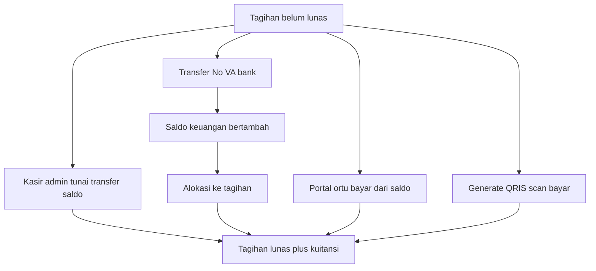

# Cara bayar tagihan MARKAZ_AL_AZIZ

Modul **Keuangan** (pengganti SIKEU lama). Dokumen ini menjelaskan alur bisnis + lampiran teknis VA dan QRIS.

---

## Kamus singkat

| Istilah | Arti |
| --- | --- |
| Jenis tagihan | Template (SPP, daftar ulang) di Master Data |
| Tagihan | Kewajiban per siswa per periode |
| No. VA | Virtual account 16 digit (`VA_PREFIX` + NIS) untuk transfer bank |
| Pembayaran / kuitansi | Bukti satu transaksi (bisa multi-tagihan) |
| Saldo keuangan | Dompet SPP siswa (bukan cashless kantin) |
| QRIS | Bayar dengan scan QR; settle seperti kasir (`method=qris`) |
| Cashless | Dompet kantin — bukan untuk bayar SPP |
| Pindah saldo | Saldo keuangan → cashless (belanja), bukan pelunasan tagihan |

Status tagihan: **Belum Lunas / Cicilan / Lunas**. Tagihan biasa harus lunas sekaligus; sebagian resmi hanya lewat mode cicilan.

---

## Empat cara bayar

1. **Kasir admin** — Keuangan → Pembayaran: pilih siswa, centang tagihan, metode Tunai / Manual BMI / Transfer / Saldo.
2. **VA bank** — transfer ke No. VA; bank panggil API; top-up saldo lalu alokasi tagihan. Wali tidak klik bayar di app.
3. **Portal ortu (saldo)** — bayar dari saldo keuangan anak. Siswa hanya melihat.
4. **QRIS** — admin/ortu generate QR → scan → pushNotif/check-status melunasi tagihan (`method=qris`). Tidak menulis `sccttran` / `saldo_keuangan`.

---

## Siapa mengerjakan apa

- **Admin:** buat tagihan, kasir, generate QRIS, batalkan pembayaran, saldo, WA.
- **Orang tua:** lihat tagihan + VA; bayar saldo; generate QRIS; pindah saldo → cashless.
- **Siswa:** lihat saja.
- **Bank / Lazismu:** VA API atau QRIS generate + pushNotif.

---

## Urutan kerja admin

1. Jenis Tagihan → Tagihan (generate/manual/import)
2. Opsional: potongan, kirim WA
3. Bayar: kasir **atau** minta wali scan QRIS / transfer VA
4. Riwayat; jika salah: Batalkan Pembayaran

Aktifkan QRIS di `.env`: `QRIS_ENABLED=true` plus `QRIS_JWT_KEY`, `QRIS_ACCOUNT_NO`, `QRIS_MITRA_CUSTOMER_ID`, `QRIS_VANO_PREFIX`.

---

## Lampiran teknis: VA (PAYMENT)

Endpoint: `GET /api/finance/payment?token=…`

**INQUIRY** — baca `siswa` + `tagihan` unpaid; tidak menulis.

**PAYMENT** — dalam 1 transaksi:

1. `sccttran` INSERT `TOP UP` (`CUSTID`, `KREDIT`, `NOREFF`, …)
2. `saldo_keuangan.balance` +
3. Per tagihan eligible: `sccttran` `FROM INVOICE`, `pembayaran` + `pembayaran_detail`, `tagihan` (`paid`, `status`, `paid_dt`, `reference`, …), `saldo_keuangan.balance` −

---

## Lampiran teknis: QRIS

### Generate

`POST` admin `admin.keuangan.pembayaran.qris.store` atau portal `portal.ortu.tagihan.qris.store`

JWT ke `QRIS_GENERATE_URL` (`http://103.23.103.43/qris/lazizmu_diy/server.php?token=…`):

- `accountNo`, `amount`, `mitraCustomerId`, `transactionId`, `tipeTransaksi: MTR-GENERATE-QRIS-DYNAMIC`, `vano`

Respons: `transactionDetail.rawQrData`, `transactionQrId`, `expiredTime?`

Disimpan di:

| Tabel | Kolom penting |
| --- | --- |
| `qris_payments` | `siswa_id`, `vano`, `amount`, `qris_id`, `raw_qr_data`, `status=pending`, payload JSON |
| `qris_payment_tagihan` | `qris_payment_id`, `tagihan_id`, `amount` |

### Push notif (saat sudah bayar)

Islamic Center `qris/pushNotif.php` switch by 6 digit awal `vano`:

| Prefiks | Handler |
| --- | --- |
| `880088` | `pushNotif/markaz.php` → forward ke Markaz |
| `111111` | dummy |
| `508001` | walisongo |
| lainnya | metaschool / tenant lain |

Markaz menerima: `GET|POST /api/finance/qris/push-notif?token=…` (JWT `QRIS_JWT_KEY`). Config IC: `config/connectMarkaz.php` (`push_notif_url`, `vano_prefix`).

Payload luar: `responseCode`, `transactionId`, `data.{vano1, amount, transactionQrId, accountNo}`

Match: `qris_id` lalu `vano` pending.

Settle (tanpa `sccttran`):

| Tabel | Perubahan |
| --- | --- |
| `pembayaran` | INSERT `method=qris`, `reference=qris_id` |
| `pembayaran_detail` | INSERT per tagihan |
| `tagihan` | `paid`, `status=1`, `paid_dt`, `reference`, `fidbank=qris` |
| `qris_payments` | `status=paid`, `paid_flag=1`, `pembayaran_id`, `push_payload` |

Cadangan: `POST …/qris/{id}/check` → `MTR-CHECKSTATUS-QRIS-DYNAMIC` ke server 43.

---

## Yang tidak dicampur

- Cashless kantin ≠ bayar SPP / QRIS tagihan
- Tunai/transfer kasir dan QRIS **tidak** menulis ledger VA
- VA online dan QRIS adalah jalur terpisah
