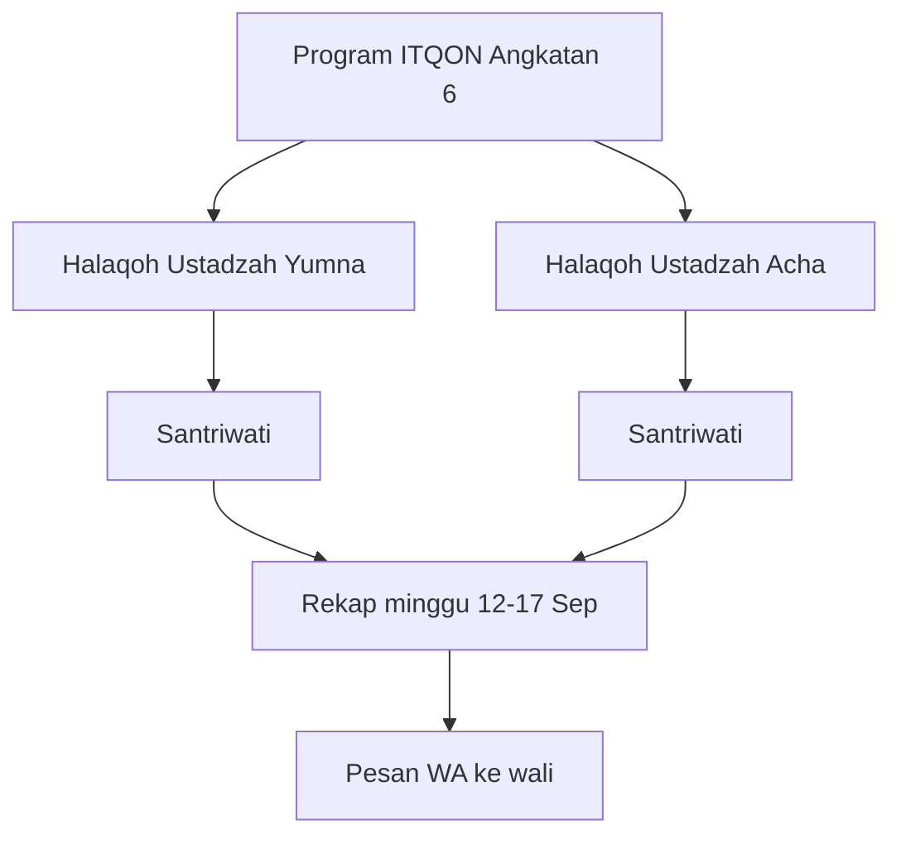

# Alur Tahfidz MARKAZ_AL_AZIZ

Dokumen ini menjelaskan **bisnis proses** Tahfidz, bukan teknis kode. Tujuannya agar admin, ustadzah, dan wali paham: apa itu halaqoh, data apa yang dicatat, dan kapan rekap dikirim ke orang tua.

---

## Ibaratnya seperti apa?

Bayangkan kelas mengaji, tapi kelompoknya **bukan kelas sekolah** (kelas 7A, 8B, dst).

- **Program** = angkatan / gelombang. Contoh: *ITQON Angkatan 6*.
- **Halaqoh** = kelompok kecil di bawah satu ustadzah. Contoh: *Halaqoh Ustadzah Yumna* berisi Kak Rifdah, Kak Kayyisah, dst.
- **Jadwal** = hari dan jam kelompok itu setoran.
- **Rekap** = laporan pencapaian **satu minggu** (misalnya 12–17 September), lalu dikirim ke wali via WhatsApp.

Satu anak punya **kelas sekolah** untuk pelajaran umum, dan bisa punya **halaqoh** untuk setoran Qur’an. Dua hal itu terpisah di sistem.

---

## Kamus singkat

| Istilah | Artinya sederhana |
| --- | --- |
| **Tahfidz** | Program menghafal Al-Qur’an. |
| **Halaqoh** | Lingkaran belajar: beberapa santriwati + satu ustadzah. Bukan kelas sekolah. |
| **Ustadzah / guru tahfidz** | Pembimbing halaqoh. Yang mendengar setoran dan mengisi rekap. |
| **Angkatan** | Gelombang / angkatan program, misalnya Angkatan 6. |
| **Juz** | Bagian Al-Qur’an (1–30). “Total hafalan 5 juz” artinya sudah hafal lima bagian. |
| **Tatsbit** | Penguatan hafalan yang **sudah ada**. Minggu ini anak menguatkan juz berapa. |
| **Muroja’ah partner** | Mengulang hafalan **berpasangan** dengan teman. Juz yang diulang minggu ini. |
| **Setoran / tasmi’** | Menyimakkan hafalan ke ustadzah. *Tasmi’ 5 juz sekali duduk* = lancar 5 juz tanpa berhenti. |
| **Prestasi** | Catatan istimewa minggu itu, misalnya tasmi’ 5 juz. Boleh kosong. |
| **Hadir / sakit / pulang** | Absensi **halaqoh**, bukan absensi sekolah. *Pulang* = pulang ke rumah / cuti pondok. |
| **Progress** | Catatan per ayat/surah (lancar, mutqin, dst). Pelacak detail, terpisah dari rekap minggu. |
| **Target** | PR hafalan yang diberikan ke anak (surah/juz sampai tanggal tertentu). |

Kalau bingung, pegang ini dulu: **halaqoh + rekap minggu = laporan ke orang tua**. Progress/target = catatan latihan harian yang lebih rinci.

---

## Siapa mengerjakan apa

| Peran | Tugas di Tahfidz |
| --- | --- |
| **Admin** | Membuat program, halaqoh, anggota, jadwal. Bisa isi/koreksi rekap. Mengirim WA ke wali. |
| **Ustadzah (portal guru)** | Hanya melihat **halaqohnya sendiri**. Mengisi rekap minggu: tatsbit, murojaah, absensi, total juz, prestasi. |
| **Santriwati (portal siswa)** | Membaca mushaf, mencatat progress sendiri, melihat rekap minggunya. |
| **Orang tua (portal ortu)** | Hanya **membaca** progress dan rekap anak. Tidak mengisi. |

Nomor WhatsApp diambil dari data orang tua (telepon ayah, kalau kosong ibu, kalau kosong wali). Tanpa nomor, tombol kirim WA tidak bisa dipakai.

---

## Alur kerja minggu biasa

Ini alur yang dipakai Markaz, contoh rekap *Santriwati ITQON Angkatan 6*.

1. **Sekali di awal (admin)**  
   Buat Program → buat Halaqoh per ustadzah → masukkan anggota → isi Jadwal (hari/jam).

2. **Setiap minggu (ustadzah atau admin)**  
   Buka menu **Rekap** → pilih program dan tanggal (misalnya 12–17 September) → isi per anak:
   - Tatsbit: juz yang dikuatkan, contoh `1,2,4`
   - Muroja’ah partner: juz yang diulang berpasangan, contoh `6,7,8,9,10` (angka boleh berulang, artinya diulang lebih dari sekali)
   - Absensi: berapa hari hadir / sakit / pulang
   - Total seluruh hafalan: angka juz yang sudah dikuasai (bukan dihitung otomatis dari progress ayat)
   - Prestasi: opsional

3. **Kirim ke wali (admin)**  
   Menu **Kirim WA** → pilih anak → preview pesan → **Buka WhatsApp**.  
   Sistem **tidak mengirim otomatis**. Admin yang menekan kirim di aplikasi WhatsApp.  
   Orang tua menerima **bagian anaknya saja**, bukan daftar seluruh halaqoh.

4. **Yang dilihat wali / anak**  
   Portal ortu dan siswa menampilkan rekap minggu + progress ayat (hanya baca untuk ortu).

---

## Urutan menu admin

Kerjakan dari atas ke bawah. Jangan langsung buka Rekap kalau halaqoh belum ada anggotanya.

1. **Program** — nama program, angkatan, label peserta (SANTRIWATI).
2. **Halaqoh** — buat kelompok (program + ustadzah). Anggota **tidak** diisi di tombol Tambah Halaqoh; lihat langkah di bawah.
3. **Jadwal** — hari dan jam setoran per halaqoh. Dipakai agar absensi rekap mengikuti hari pertemuan.
4. **Rekap** — laporan minggu. Di sini isi tatsbit / murojaah / absensi.
5. **Kirim WA** — preview dan buka `wa.me` ke wali.
6. **Progress** dan **Target** — pelacak ayat (opsional, terpisah dari laporan minggu ke ortu).

### Cara memasukkan anggota

Menu **Admin → Tahfidz → Halaqoh**.

1. Buat halaqoh dulu (tombol **Tambah Halaqoh**: pilih program + ustadzah). Itu hanya membuat kelompok, belum ada anak.
2. Di tabel, **klik nama halaqoh** (tulisan biru, misalnya *Halaqoh Ustadzah Yumna*). Jangan pakai ikon edit — itu hanya ubah ustadzah/nama.
3. Di halaman detail ada form **Tambah anggota**: pilih siswa, isi **Total juz** awal (boleh 0), lalu **Simpan anggota**.
4. Ulangi per anak. Daftar anggota tampil di bawah form. Tombol **Hapus** melepaskan anak dari halaqoh itu.

Anak harus sudah ada di data siswa. Satu anak tidak bisa masuk dua kali di halaqoh yang sama.

---

## Contoh isi rekap satu anak

Dari contoh Markaz, satu baris anak kurang lebih begini:

- **Tatsbit:** Juz 1, 2, 4 — minggu ini menguatkan tiga juz itu  
- **Muroja’ah partner:** Juz 6, 7, 8, 9, 10 — mengulang bersama teman  
- **Absensi:** hadir 4 hari, sakit tidak ada, pulang tidak ada  
- **Total hafalan:** 5 juz (akumulasi, bukan hanya minggu ini)  
- **Prestasi:** Tasmi’ 5 juz sekali duduk (1–5)

Itulah yang disusun sistem menjadi teks WhatsApp.

---

## Yang sengaja tidak dicampur

- Absensi halaqoh **bukan** absensi pelajaran sekolah. Status *pulang* hanya ada di rekap tahfidz.
- Halaqoh **bukan** kelas akademik. Anak dari kelas berbeda bisa satu halaqoh.
- Total juz di rekap **diisi petugas**, tidak dihitung otomatis dari progress per ayat.
- Belum ada rekaman suara / murottal. Setoran dicatat sebagai angka juz dan teks prestasi.

---

## Ringkas dalam satu kalimat

**Admin merakit kelompok (program + halaqoh + jadwal), ustadzah mengisi laporan minggu per anak, admin mengirim laporan itu ke WhatsApp wali.**
