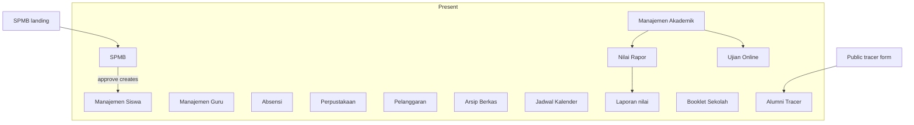

# Modul Akademik — gap map and roadmap

**Status:** Phase 0–3 complete (Berkas, SPMB, akademik, ujian, booklet, alumni/tracer).  
**Overview:** Gap map of the 14 Modul Akademik cards vs Ittihad. All catalog items that were planned in this roadmap are now Present (MVP where noted).

Your HTML list is a **product catalog** (landing-page cards). This Ittihad app is a **Serang ops platform**.

## Gap map (catalog → Ittihad)

| Catalog card | Status | What exists today |
|---|---|---|
| Manajemen Siswa | Present | [`config/admin-menu.php`](../config/admin-menu.php) → `admin.manajemen-siswa.*` |
| Manajemen Guru | Present | `admin.manajemen-guru.*` |
| Pelanggaran | Present | `admin.prestasi-pelanggaran.*` (prestasi + pelanggaran + hukuman) |
| Perpustakaan | Present | `admin.perpustakaan.*` + portals |
| Absensi | Present | `admin.absensi.*` (incl. RFID/face, `Pelajaran` for **attendance slots only**) |
| Arsip/Berkas | Present | `admin.manajemen-siswa.berkas-siswa.*` + `DokumenSiswa` |
| Manajemen Akademik | Present | `admin.akademik.*` — kurikulum, mapel, KD (separate from absensi `Pelajaran`) |
| Jadwal / Kalender | Present | `admin.akademik.jadwal-pelajaran.*` + `admin.akademik.kalender.*` |
| Akademik (nilai, rapor, …) | Present | `admin.akademik.nilai.*` + `admin.akademik.rapor.*` + portal rapor |
| Laporan nilai | Present | `admin.akademik.laporan-nilai.*` |
| Booklet Sekolah | Present (MVP) | `admin.booklet.*` + portal `portal.{siswa,ortu,guru}.booklet.*` |
| Ujian online | Present (MVP) | `admin.ujian.*` + `portal.siswa.ujian.*` |
| **SPMB** | Present | Public `/spmb` + `admin.spmb.*` + `siswa.nomor_pendaftaran` |
| Alumni / tracer | Present (MVP) | `admin.alumni.*` + public `/alumni/tracer` |

## Roadmap status

### Phase 0 — DONE
Berkas siswa wired.

### Phase 1 — DONE
SPMB + `siswa.nomor_pendaftaran` + public landing.

### Phase 2 — DONE
Kurikulum / mapel / KD / jadwal / kalender / nilai / rapor / laporan + portal rapor.

### Phase 3a — DONE
Ujian online MVP.

### Phase 3b — DONE
Booklet sekolah MVP.

### Phase 3c — DONE
Alumni registry + tracer study (admin + public form).

## Out of scope for this roadmap
- Rewriting Present modules unless integration requires small changes.
- Product-catalog marketing HTML (`register.html` / `lp-group-*`).
- Later enhancements: bank soal ujian, essay grading UI, guest booklet, alumni portal login, promote siswa→alumni workflow.
