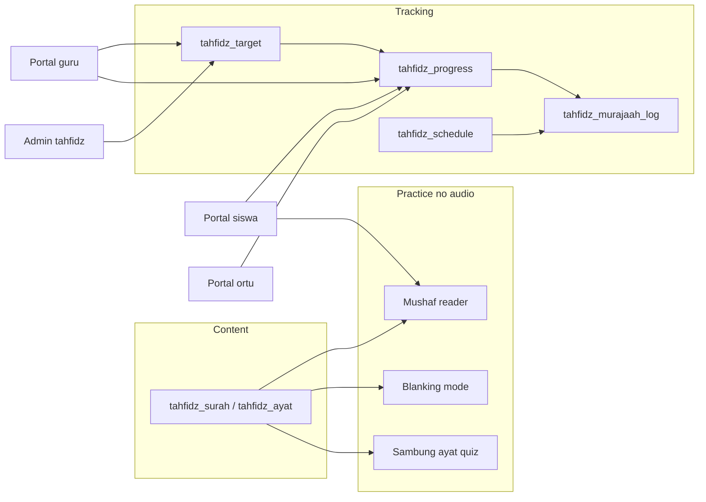

# Tahfidz Module Plan

**Status:** Phase 0–1 complete. Phase 3 halaqoh/jadwal/rekap WA complete. Phase 2 (blanking/quiz) deferred.  
**Overview:** Greenfield Tahfidz (Quran memorization) module on the existing Blade admin/portal pattern. Voice and audio are out of scope. Default: seed Kemenag-style ayah text into the DB, then ship mushaf reader plus hafalan progress. Operational Markaz flow uses halaqoh groups, weekly recap (tatsbit / murojaah partner / absensi), and parent `wa.me` messages. Blanking and quiz remain later.

## What Tahfidz means here

**Tahfidz** is a Quran memorization program: students memorize ayat, keep them with **murajaah** (review), and later may do **setoran** to a mentor. This module tracks text, progress, self-practice, and schedules — not murottal or voice recording.

## Defaults (locked)

- **Quran text:** seed Indonesian Kemenag-compatible surah/ayat JSON into the DB (offline; enables blanking and quiz). Not a runtime API; not scanned mushaf page images in MVP.
- **Voice out:** no murattal player, no looping audio, no voice recorder, no audio tasmi.
- **Setoran without voice:** status-based (siswa update + guru verify). Audio upload deferred.
- **Reminders:** weekly recap to parents via `wa.me` (`TahfidzRekapWhatsAppService`); no WhatsApp Business API.
- **Stack:** Blade + kit JS (same as booklet / ujian) — no SPA.
- **Roles:** admin oversee + send WA; **siswa** practice + read recap; **guru** fill own halaqoh recap / verify progress; **ortu** read-only child progress and weekly recap.

## Scope vs friend list

- **In:** mushaf digital (juz/surah/page text), blanking, progress tracker, quiz/sambung ayat, in-app murajaah schedule
- **Out:** murattal audio/loop, voice recorder, audio setoran

## Phase 0 — Wiring shell

Mirror booklet/ujian registration:

- Permissions `tahfidz.view|create|update|delete` in [`database/seeders/RolePermissionSeeder.php`](../database/seeders/RolePermissionSeeder.php)
- Module in [`app/Support/AdminModuleAccess.php`](../app/Support/AdminModuleAccess.php) (menu label **Tahfidz**)
- Sidebar group in [`config/admin-menu.php`](../config/admin-menu.php): Dashboard, Progress, Target, Jadwal
- Portal menus in `config/portal-menus/{siswa,guru,orang-tua}.php`
- Routes `admin.tahfidz.*` + portal role routes
- Controller/view stubs + dashboard `<x-dashboard.launcher>`
- [`.ai/rules/tahfidz.md`](../.ai/rules/tahfidz.md) + index globs
- Feature smoke test: admin dashboard + portal siswa index load

## Phase 1 — Mushaf text + progress tracker

**Schema** (singular tables, `BaseModel`, soft deletes where appropriate):

- `tahfidz_surah` — number, name_ar, name_id, ayah_count, revelation_type
- `tahfidz_ayat` — surah_id, ayah_number, text_ar, text_id optional, juz, page
- `tahfidz_target` — siswa_id, sekolah_id, range (surah/ayat from-to or juz), period daily/weekly, due_date, assigned_by
- `tahfidz_progress` — siswa_id, surah_id, ayah_from, ayah_to, status `belum` | `proses` | `lancar` | `mutqin`, last_reviewed_at, verified_by nullable
- `tahfidz_murajaah_log` — progress_id, reviewed_at, note, source `siswa`|`guru`

**Seeders:** `TahfidzQuranSeeder` from `database/seeders/data/quran/` (license note in rule/README). `TahfidzDemoSeeder` for sample targets/progress.

**Admin:** dashboard KPIs; DataTables for targets + progress (`AdminSchoolScope`); assign target to siswa/kelas.

**Portal:**

- Siswa: mushaf reader (juz / surah / page), update progress, murajaah log
- Guru: assigned siswa, set/verify progress
- Ortu: read-only child progress via `PortalAccess`

**UI:** text ayat list with Arabic typography CSS; no page-scan images.

## Phase 2 — Blanking + quiz

- Blanking on mushaf view: hide last word / full ayah / all (tap-to-reveal) via client JS + same ayat payload
- Quiz: `tahfidz_quiz_attempt` + generated items (sambung ayat, tebak nomor ayat, tebak surah); score per siswa
- Admin optional quiz settings; portal siswa play + history

## Phase 3 — Halaqoh, jadwal, rekap WA

Operational Markaz recap (not `kelas` / school absensi):

- `tahfidz_program`, `tahfidz_halaqoh`, `tahfidz_halaqoh_anggota`, `tahfidz_jadwal`
- `tahfidz_rekap` + `tahfidz_rekap_siswa` (tatsbit/murojaah juz lists, hadir/sakit/pulang, total juz, prestasi)
- `TahfidzRekapComposer` builds the group text; child WA is per siswa
- Guru portal scoped to `guru_id`; admin Kirim WA uses `WhatsAppLink`

## Conventions

- Controllers: `Admin\Tahfidz\*`, `Portal\Siswa\Tahfidz*`, `Portal\Guru\Tahfidz*`, `Portal\OrangTua\Tahfidz*`
- Form Requests under `Http/Requests/Tahfidz/`
- Services: `TahfidzProgressService`, `TahfidzRekapComposer`, `TahfidzRekapService`, `TahfidzRekapWhatsAppService` (no audio)
- No in-page `master-data-nav`; sidebar + launcher only
- Tests: `tests/Feature/TahfidzModuleTest.php`, `tests/Feature/TahfidzHalaqohRekapTest.php`
- Pint + narrow Pest after each phase

## Build order when implementing

1. Phase 0 shell + empty mushaf placeholder
2. Quran seed + mushaf reader
3. Progress / target / murajaah
4. Blanking + quiz
5. Schedules

## Implementation todos

- [x] Phase 0: permissions, AdminModuleAccess, menus, routes, dashboard stubs, `.ai/rules/tahfidz.md`, smoke tests
- [x] Phase 1a: `tahfidz_surah`/`ayat` schema + Kemenag JSON seeder + mushaf reader UI
- [x] Phase 1b: targets, progress statuses, murajaah log; admin + siswa/guru/ortu portals
- [ ] Phase 2: blanking modes + sambung-ayat/quiz attempts
- [x] Phase 3: halaqoh + jadwal + weekly recap + parent `wa.me`

Voice/audio stays a later epic and must not block Phases 0–3.
